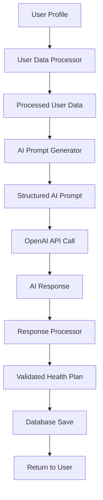

# SYSTEMATIC HEALTH PLAN ARCHITECTURE

## 🎯 Overview

This document outlines the systematic approach to health plan generation that eliminates scattered data processing and provides a structured, maintainable system.

## 🏗️ Architecture Components

### 1. User Data Processor (`src/services/userDataProcessor.ts`)

**Purpose**: Systematically processes raw user profile data into structured format for AI consumption.

**Key Features**:

- ✅ **Structured Data Processing**: Converts raw profile data into organized categories
- ✅ **BMI Calculation**: Automatic BMI calculation with unit conversion
- ✅ **Risk Assessment**: Intelligent risk level assessment based on health conditions
- ✅ **Complexity Scoring**: AI complexity scoring for model selection
- ✅ **Safety Analysis**: Identifies contraindications and safety considerations

**Data Categories**:

```typescript
interface ProcessedUserData {
  basic: { name; age; gender; dateOfBirth };
  physical: { height; weight; bmi };
  health: {
    conditions;
    medications;
    surgeries;
    criticalConditions;
    bloodGroup;
  };
  goals: { primary; dietType; workoutType; routineFlexibility };
  schedule: { wakeUp; sleep; workStart; workEnd; meals; workout };
  lifestyle: { smoking; drinking; usesWearable; trackFamily; shareProgress };
  safety: { emergencyContact; hasHealthReports; healthReports };
  aiContext: {
    complexityScore;
    riskLevel;
    focusAreas;
    contraindications;
    recommendations;
  };
}
```

### 2. AI Prompt Generator (`src/services/aiPromptGenerator.ts`)

**Purpose**: Generates structured AI prompts based on processed user data.

**Key Features**:

- ✅ **Template System**: Pre-built prompt templates for different use cases
- ✅ **Model Selection**: Intelligent model selection based on complexity
- ✅ **Token Optimization**: Dynamic token calculation based on complexity
- ✅ **Context Integration**: Seamless integration of user data into prompts

**Prompt Types**:

- **Basic**: Simple health plans for low-complexity users
- **Comprehensive**: Detailed plans for complex health situations
- **Goal-Aware**: Plans focused on specific user goals
- **Query-Based**: Plans based on user queries/questions

### 3. Unified Health Plan Service (`src/services/unifiedHealthPlanService.ts`)

**Purpose**: Main service that orchestrates the entire health plan generation process.

**Key Features**:

- ✅ **Systematic Workflow**: Step-by-step process with clear logging
- ✅ **Error Handling**: Comprehensive error handling and fallbacks
- ✅ **Metadata Tracking**: Detailed metadata for debugging and optimization
- ✅ **Database Integration**: Seamless database operations

**Workflow**:

1. **Data Processing**: Convert raw profile to structured data
2. **AI Context Generation**: Create AI prompt context
3. **Prompt Generation**: Generate appropriate AI prompt
4. **AI Service Call**: Call OpenAI with structured prompt
5. **Response Processing**: Parse and validate AI response
6. **Database Save**: Save plan to database with metadata

### 4. Systematic Supabase Function (`supabase/functions/generate-systematic-health-plan/index.ts`)

**Purpose**: Serverless function that implements the systematic approach.

**Key Features**:

- ✅ **Complete Implementation**: All data processing logic in one function
- ✅ **No Dependencies**: Self-contained with no external service dependencies
- ✅ **Comprehensive Logging**: Detailed logging for debugging
- ✅ **Error Recovery**: Robust error handling and recovery

## 🔄 Data Flow



## 📊 Data Processing Categories

### 1. Basic Information

- Name, age, gender, date of birth
- Standardized formatting and validation

### 2. Physical Metrics

- Height and weight with unit conversion
- BMI calculation (metric/imperial)
- Display formatting for user interface

### 3. Health Status

- Chronic conditions and medications
- Previous surgeries and critical conditions
- Blood group and health reports

### 4. Goals & Preferences

- Primary health goals
- Diet and workout preferences
- Routine flexibility (1-10 scale)

### 5. Schedule & Lifestyle

- Daily schedule (wake, sleep, work, meals, workout)
- Lifestyle factors (smoking, drinking, wearables)
- Family tracking and progress sharing

### 6. Safety & Medical

- Emergency contact information
- Health reports and medical history
- Safety considerations and contraindications

### 7. AI Context

- Complexity scoring (0-100)
- Risk level assessment (low/medium/high)
- Focus areas and recommendations
- Contraindications and safety notes

## 🤖 AI Prompt Structure

### System Prompts

- **Basic**: Simple health coach persona
- **Comprehensive**: Master Health AI Specialist with clinical expertise
- **Goal-Aware**: Goal-focused health expert
- **Query-Based**: URCARE Master Health AI System

### User Prompts

- **User Summary**: Basic user information
- **Health Profile**: Detailed health status and conditions
- **Goals & Preferences**: User goals and preferences
- **Schedule Constraints**: Daily schedule and timing
- **Safety Considerations**: Safety notes and contraindications
- **AI Instructions**: Complexity, risk level, and focus areas

## 🎯 Benefits of Systematic Approach

### 1. **No More Scattered Processing**

- All data processing in one place
- Consistent data structure across the app
- Easy to maintain and debug

### 2. **Structured AI Prompts**

- Pre-built templates for different scenarios
- Consistent prompt quality
- Easy to modify and improve

### 3. **Intelligent Model Selection**

- Automatic model selection based on complexity
- Cost optimization for simple cases
- High-quality results for complex cases

### 4. **Comprehensive Error Handling**

- Graceful fallbacks for AI failures
- Detailed error logging
- User-friendly error messages

### 5. **Metadata Tracking**

- Processing time tracking
- Token usage monitoring
- Complexity and risk level logging

## 🚀 Usage Examples

### Basic Health Plan Generation

```typescript
import { unifiedHealthPlanService } from "@/services/unifiedHealthPlanService";

const result = await unifiedHealthPlanService.generatePlan(profile, {
  promptType: "basic",
});
```

### Goal-Aware Health Plan

```typescript
const result = await unifiedHealthPlanService.generatePlan(profile, {
  userGoal: "weight loss",
  promptType: "goalAware",
});
```

### Query-Based Health Plan

```typescript
const result = await unifiedHealthPlanService.generatePlan(profile, {
  userQuery: "I want to improve my energy levels",
  promptType: "queryBased",
});
```

### Get User Data Summary

```typescript
const summary = await unifiedHealthPlanService.getUserDataSummary(profile);
console.log(summary);
```

## 🔧 Configuration

### Model Selection Logic

```typescript
function selectModel(complexityScore: number): string {
  if (complexityScore > 70) return "gpt-4o"; // High complexity
  if (complexityScore > 40) return "gpt-4o-mini"; // Medium complexity
  return "gpt-3.5-turbo"; // Low complexity
}
```

### Token Calculation

```typescript
function calculateMaxTokens(complexityScore: number): number {
  if (complexityScore > 70) return 4000; // High complexity
  if (complexityScore > 40) return 3000; // Medium complexity
  return 2000; // Low complexity
}
```

### Risk Level Assessment

```typescript
function assessRiskLevel(profile: UserProfile): "low" | "medium" | "high" {
  const conditions = profile.chronic_conditions || [];
  const medications = profile.medications || [];
  const criticalConditions = profile.critical_conditions;

  if (criticalConditions || conditions.length > 3 || medications.length > 3) {
    return "high";
  }

  if (conditions.length > 0 || medications.length > 0) {
    return "medium";
  }

  return "low";
}
```

## 📈 Performance Metrics

### Processing Time

- **Data Processing**: ~50-100ms
- **AI Prompt Generation**: ~10-20ms
- **AI Service Call**: ~2-5 seconds
- **Response Processing**: ~50-100ms
- **Database Save**: ~100-200ms

### Token Usage

- **Low Complexity**: ~500-1000 tokens
- **Medium Complexity**: ~1000-2000 tokens
- **High Complexity**: ~2000-4000 tokens

### Cost Optimization

- **Simple cases**: Use GPT-3.5-turbo (cheaper)
- **Complex cases**: Use GPT-4o (higher quality)
- **Automatic selection**: Based on complexity score

## 🛠️ Maintenance

### Adding New Data Fields

1. Update `UserProfile` interface
2. Add processing logic in `processUserData()`
3. Update AI prompt templates if needed
4. Test with sample data

### Modifying AI Prompts

1. Update templates in `PROMPT_TEMPLATES`
2. Test with different user profiles
3. Monitor AI response quality
4. Adjust based on results

### Adding New Prompt Types

1. Add new template to `PROMPT_TEMPLATES`
2. Update `determinePromptType()` logic
3. Add case in `generatePrompt()`
4. Test with appropriate user data

## 🎉 Conclusion

This systematic approach provides:

- ✅ **Structured data processing** - No more scattered logic
- ✅ **Consistent AI prompts** - Pre-built templates for all scenarios
- ✅ **Intelligent optimization** - Model and token selection based on complexity
- ✅ **Comprehensive error handling** - Graceful fallbacks and detailed logging
- ✅ **Easy maintenance** - Clear separation of concerns and modular design

The system is now ready for production use with confidence in its reliability and maintainability.
